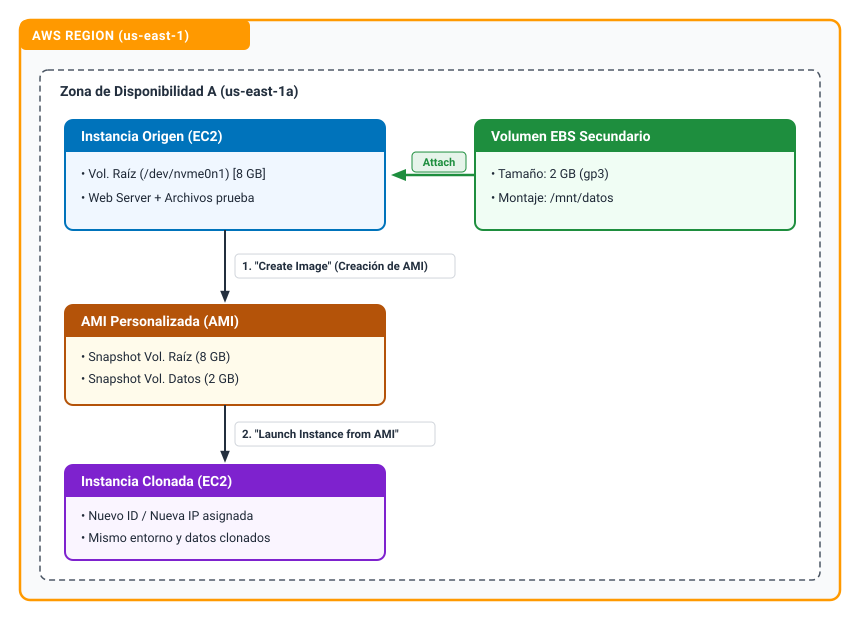

```
----------------- ADMINISTRACIÓN DE SISTEMAS INFORMATICOS EN RED ----------------
---------------------------------------------------------------------------------

Módulo:                     Computación en la nube (Optativa II)
Profesor:                   Víctor J. González
Unidad de Trabajo:          UT03. Servicios de cómputo
Práctica:                   PR0302. Gestión de volúmenes EBS secundarios y clonación con AMIs
Resultados de aprendizaje:  XX
```

# PR0302: Gestión de volúmenes EBS secundarios y clonación con AMIs

## 1. Fundamentos teóricos 

### ¿Qué es Amazon EBS (*Elastic Block Store*)?

Amazon EBS proporciona volúmenes de almacenamiento a nivel de bloque para su uso con instancias EC2. En el modelo tradicional de centro de datos, un volumen EBS equivale a un disco virtual aprovisionado desde una red de almacenamiento (**SAN** - *Storage Area Network*). El almacenamiento no reside físicamente dentro del servidor que ejecuta la máquina virtual; la comunicación entre el hipervisor y el disco se realiza a través de la red interna de alta velocidad del centro de datos de AWS.

Esta naturaleza en red introduce dos características arquitectónicas críticas que todo administrador de sistemas debe dominar:

- **Confinamiento en la Zona de Disponibilidad (AZ):** un volumen EBS se crea y replica automáticamente dentro de una Zona de Disponibilidad concreta para protegerlo frente al fallo de componentes de hardware individuales. En consecuencia, un volumen EBS solo puede conectarse a instancias EC2 situadas en **su misma Zona de Disponibilidad**. No es posible conectar directamente un volumen creado en `us-east-1a` a un servidor en `us-east-1b`.
- **Desacoplamiento del ciclo de vida:** a diferencia del almacenamiento efímero local, los volúmenes EBS tienen un ciclo de vida independiente de la instancia. Si un servidor se detiene o se elimina, los volúmenes EBS adjuntos pueden conservarse intactos, conectarse a otra máquina o utilizarse para generar copias de seguridad. El volumen raíz del sistema operativo tiene habilitado por defecto el parámetro `DeleteOnTermination=true`, mientras que los volúmenes adicionales conservan sus datos si la instancia se destruye (`DeleteOnTermination=false`).

En las infraestructuras modernas de AWS, el tipo de volumen estándar es **`gp3`** (*General Purpose SSD*). A diferencia de su predecesor `gp2` —donde el rendimiento de operaciones por segundo (IOPS) dependía estrictamente del tamaño en gigabytes contratado—, `gp3` permite provisionar IOPS y rendimiento de transferencia (*throughput*) de manera independiente a la capacidad de almacenamiento, garantizando un mínimo de 3.000 IOPS y 125 MB/s sin coste adicional sobre el almacenamiento base.


### Administración de discos en Linux bajo el hipervisor Nitro

En las familias de instancias actuales de AWS (como las `t3.micro` basadas en la arquitectura de hipervisor **AWS Nitro**), los volúmenes de almacenamiento se exponen al núcleo de Linux a través del bus PCI como dispositivos **NVMe** (*Non-Volatile Memory Express*).

Esto genera una discrepancia habitual que suele desorientar a los administradores noveles: cuando la consola web de AWS o la CLI solicita un punto de conexión como `/dev/sdf` o `/dev/xvdf` (nomenclatura clásica heredada de Xen), el kernel de Linux mapea internamente ese disco como `/dev/nvme1n1`, `/dev/nvme2n1`, etc. Por ello, nunca se debe asumir a ciegas el nombre del nodo de dispositivo; herramientas de inspección de bloques como `lsblk` y `file -s` son imprescindibles para verificar la jerarquía y el tipo de sistema de archivos antes de operar.


### Persistencia y el archivo `/etc/fstab`: el peligro del *Boot Loop*

Montar un sistema de archivos en memoria con el comando `mount` es una operación volátil que desaparece tras reiniciar la máquina. Para que el volumen secundario vuelva a montarse automáticamente durante el arranque, su configuración debe registrarse en el archivo del sistema `/etc/fstab`.

En entornos cloud existen dos reglas de oro para evitar que una máquina virtual quede inutilizable tras un reinicio:

1. **Uso obligatorio de UUID (*Universally Unique Identifier*):** nunca se debe declarar el montaje mediante la ruta del dispositivo (como `/dev/nvme1n1p1`). Los buses PCI pueden reordenar los discos durante el arranque si se desconectan y vuelven a conectar volúmenes, lo que provocaría que un disco de datos intente montarse en una ruta errónea. El UUID es una cadena inmutable generada durante el formateo que identifica unívocamente al sistema de archivos con independencia de la interfaz donde se detecte.
2. **La opción de montaje `nofail`:** si una entrada en `/etc/fstab` falla durante la secuencia de inicio de `systemd` y no cuenta con parámetros de tolerancia a fallos, el sistema detiene el arranque y entra en modo de rescate. En una máquina local esto se soluciona conectando un teclado y un monitor, pero en una instancia EC2 sin consola interactiva tradicional provoca la pérdida total de acceso SSH. Declarar la directiva `nofail` en las opciones de montaje ordena al sistema operativo continuar con el arranque normal incluso si el disco secundario no está presente o no puede ser montado.


### Snapshots y Amazon Machine Images (AMIs)

Un **Snapshot de EBS** es una copia de seguridad puntual de un volumen de bloques. Estos snapshots se almacenan de forma duradera en el servicio de almacenamiento de objetos Amazon S3 (gestionado de forma interna y transparente por AWS). Además, los snapshots son **incrementales**: el primero guarda todos los bloques de datos ocupados en el disco, mientras que los siguientes solo registran los bloques que han cambiado desde la última captura, optimizando costes y tiempo de transferencia.

Una **AMI (*Amazon Machine Image*)** es una plantilla empaquetada que sirve como molde para instanciar servidores virtuales completos y homogéneos. A nivel estructural, una AMI se compone de tres elementos:

- Una o más instantáneas (*snapshots*) de los volúmenes de almacenamiento de la máquina de origen (incluyendo obligatoriamente el volumen raíz del sistema operativo).
- Una tabla de mapeo de dispositivos de bloques (*Block Device Mapping*), que describe la arquitectura de discos, sus puntos de montaje y los tamaños correspondientes.
- Metadatos de lanzamiento: arquitectura del procesador (x86_64 o ARM), permisos de acceso y el kernel inicial.

Crear una AMI a partir de una máquina en ejecución permite clonar configuraciones maestras, preparar entornos para grupos de autoescalado o disponer de un mecanismo de recuperación ante desastres. Si la máquina de origen se encuentra en ejecución durante la captura, se recomienda sincronizar y vaciar los búferes de memoria al disco (`sync`) o detener temporalmente los servicios de base de datos para garantizar la consistencia lógica de los datos capturados.


## 2. Objetivos de la práctica

1. Aprovisionar un volumen EBS secundario en la Zona de Disponibilidad correspondiente e integrarlo en caliente en una instancia EC2 en funcionamiento.
2. Identificar dispositivos de almacenamiento NVMe en Linux, formatear con el sistema de archivos `ext4` y configurar el punto de montaje permanente mediante UUID y la directiva `nofail`.
3. Comprobar la tolerancia a fallos y la persistencia de datos tras reinicios del sistema operativo.
4. Generar una imagen personalizada (AMI) a partir de la instancia configurada.
5. Desplegar una segunda máquina virtual a partir de la nueva AMI y validar que la configuración, servicios y datos se han clonado de manera exacta.

---

## 3. Guía paso a paso




### Paso 1: Verificación de la zona y lanzamiento de la máquina base

1. En la consola de AWS, acceder a **EC2** > **Instances**.
2. Lanzar una instancia base con **Amazon Linux 2023**, tipo `t2.micro` o `t3.micro`, asociada al Security Group de servidor web (`sg-servidor-web-asir`) y con par de claves.
3. No te olvides de seleccionar la instancia en el panel y localizar en los detalles el campo **Availability Zone** (por ejemplo, `us-east-1a`). Anota este valor exacto.


### Paso 2: Creación y conexión del volumen EBS

1. En el menú lateral izquierdo, navegar a **Elastic Block Store** > **Volumes**.
2. Pulsar en **Create volume** y configurar los parámetros:
   - **Volume type:** `General Purpose SSD (gp3)`.
   - **Size (GiB):** `2` (suficiente para la prueba y ahorra cuota de laboratorio).
   - **Availability Zone:** seleccionar **exactamente la misma zona** que la instancia del Paso 1.
   - **Tags:** Clave `Name`, Valor `ebs-datos-asir`.
3. Hacer clic en **Create volume**. Esperar unos segundos a que el estado del volumen cambie de *Creating* a **Available**.
4. Seleccionar el volumen recién creado, pulsar en el menú **Actions** > **Attach volume**.
5. En el campo **Instance**, seleccionar la máquina virtual base.
6. En **Device name**, la consola propondrá una ruta estándar como `/dev/sdf`. Aceptar el valor por defecto y confirmar pulsando en **Attach volume**. El estado del volumen pasará a **In-use**.


### Paso 3: Configuración del almacenamiento en el sistema operativo

1. Conectarse a la instancia mediante SSH con el usuario `ec2-user`.
2. Inspeccionar la topología de bloques detectada por el núcleo de Linux con `lsblk`. Deberías observar aquí  el disco raíz (`nvme0n1`) con sus particiones y un nuevo disco sin particionar de 2 GB denominado generalmente **`nvme1n1`**.
3. Verificar si el nuevo disco contiene ya algún sistema de archivos con `udo file -s /dev/nvme1n1`. Si la respuesta es `/dev/nvme1n1: data`, el disco está completamente vacío y requiere formateo.
4. Formatear el dispositivo completo directamente con el sistema de archivos `ext4` con la orden `sudo mkfs -t ext4 /dev/nvme1n1`
5. Crear el directorio que servirá como punto de montaje (`mkdir -p /mnt/datos`) y asociar el disco `sudo mount /dev/nvme1n1 /mnt/datos`
6. Crear un archivo de prueba para comprobar la persistencia de datos:

    ```bash
    echo "Datos de producción en volumen EBS - $(date)" | sudo tee /mnt/datos/evidencia.txt
    ls -la /mnt/datos/
    ```


### Paso 4: Automatización del montaje en `/etc/fstab` mediante UUID

1. Obtener el UUID asignado a la partición o disco formateado: `sudo blkid /dev/nvme1n1`. Copiar el identificador alfanumérico que aparece en el atributo `UUID="..."` (por ejemplo, `e2a7b8c1-3f4a-4b9a-8e2b-1a2b3c4d5e6f`).
2. Crear una copia de respaldo del archivo de configuración antes de editarlo: `sudo cp /etc/fstab /etc/fstab.bak`
3. Abrir `/etc/fstab` con un editor de texto y añadir al final del archivo una línea con la siguiente sintaxis (reemplazando el UUID por el obtenido):
    ```text
    UUID=tu-uuid-aqui    /mnt/datos    ext4    defaults,nofail    0    2
    ```
4. Para comprobar que la sintaxis de `/etc/fstab` es correcta antes de reiniciar, desmontar el disco y forzar la recarga de todos los puntos de montaje declarados realiza la siguiente comprobación. Si el comando `mount -a` no devuelve ningún error y al ejecutar `df -h /mnt/datos` el disco vuelve a aparecer montado, la configuración es correcta y segura frente a reinicios.
    ```bash
    sudo umount /mnt/datos
    sudo mount -a
    ```


### Paso 5: Creación de la AMI (*Amazon Machine Image*)

1. En la consola de AWS, ir a **EC2** > **Instances**.
2. Seleccionar la instancia configurada, pulsar en **Actions** > **Image and templates** > **Create image**.
3. Rellenar los campos requeridos:
   - **Image name:** `ami-servidor-completo-asir`.
   - **Image description:** `Imagen con volumen EBS secundario montado`.
   - En la tabla **Instance volume snapshot and disk settings**, observar que AWS detecta automáticamente tanto el volumen raíz (`/dev/xvda`) como el volumen secundario recién conectado (`/dev/sdf`).
4. Pulsar en **Create image**.
5. Ir a la sección **Images** > **AMIs** en el menú izquierdo. El estado inicial será `pending`. El proceso tardará unos minutos mientras AWS genera los snapshots en S3; esperar a que el estado cambie a **Available**.


### Paso 6: Lanzamiento y verificación de la instancia clonada

1. Con la AMI en estado *Available*, seleccionarla y hacer clic en el botón superior **Launch instance from AMI**.
2. En el asistente de configuración:
    - **Name:** `servidor-clonado-asir`.
    - **Instance type:** `t2.micro` o `t3.micro`.
    - **Key pair:** seleccionar tu par de claves.
    - **Network settings:** asignar el mismo Security Group (`sg-servidor-web-asir`) y asegurar que **Auto-assign public IP** esté habilitado.
    - En la sección **Configure storage**, verificar que la plantilla ya incluye los dos discos (el raíz de 8 GB y el secundario de 2 GB) heredados de la AMI.
3. Pulsar en **Launch instance**.
4. Una vez la nueva máquina esté en estado `Running`, conectarse a ella mediante SSH usando su **nueva IP pública**: `ssh -i "clave_privada.pem" ec2-user@<IP_PUBLICA_DEL_CLON>`

5. Verificar si el volumen secundario y los datos existen en la máquina clonada con los siguientes comandos. El disco secundario se habrá creado como un nuevo volumen EBS a partir del snapshot, y el sistema operativo lo habrá montado automáticamente en `/mnt/datos` durante el arranque gracias a la entrada clonada en `/etc/fstab`, conteniendo el archivo `evidencia.txt` íntegro.

    ```bash
    lsblk
    df -h /mnt/datos
    cat /mnt/datos/evidencia.txt
    ```


